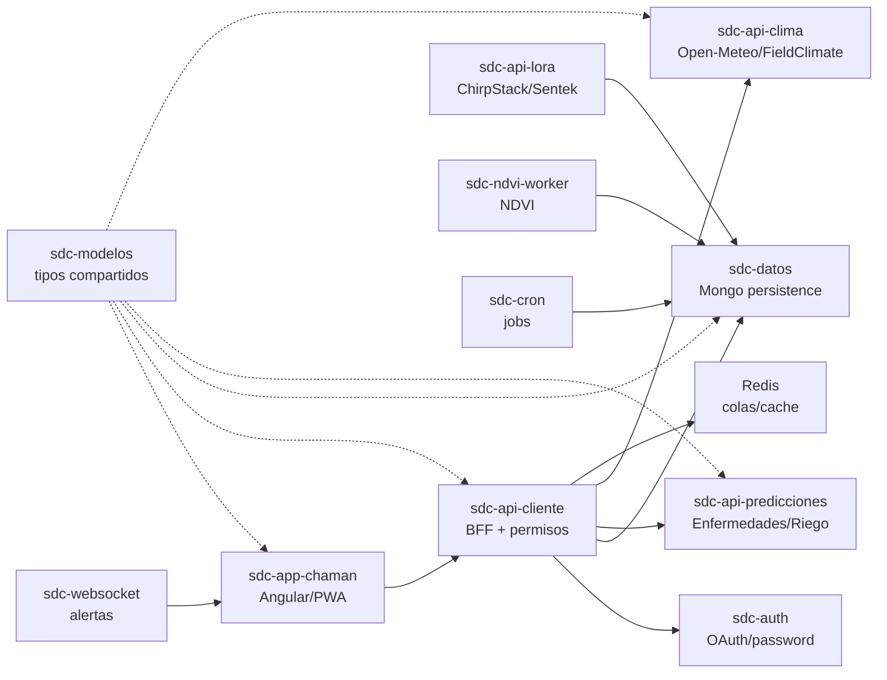

# Architecture

## Vista logica



## Modelo multi-tenant

La jerarquia de visibilidad es:

```text
Admin
  Quimica
    Distribuidor
      Productor
        Establecimiento
          Lote
            Siembra
```

Las entidades operativas deben conservar, cuando corresponda, `idQuimica`, `idDistribuidor`, `idProductor` e `idEstablecimiento` para permitir roll-up de informacion.

## Servicios agronomicos por lote

- Fenologia por cultivo, variedad/ciclo, departamento y fecha de siembra.
- Prediccion de enfermedades por etapa fenologica, humedad, lluvia, temperatura y susceptibilidad varietal.
- Riego por humedad de suelo, ET0, clima y sensores Sentek/ChirpStack.
- NDVI por lote y analisis de vigor.
- Huella hidrica verde, azul y gris.
- Fertilizacion y fumigacion con base de fertilizantes/principios activos.
- Alertas por umbrales.

## Clima

Prioridad operativa:

1. Estacion propia o FieldClimate cuando el cliente tenga equipo/credenciales.
2. Open-Meteo como fallback gratuito para no bloquear predicciones.
3. Proveedores pagos opcionales segun disponibilidad.

## Blockchain futuro

No acoplar la logica actual a blockchain. Preparar eventos auditables: creacion de productor, establecimiento, lote, siembra, aplicacion, prediccion, cosecha y huella consolidada. Esos eventos pueden firmarse o anclarse despues.
